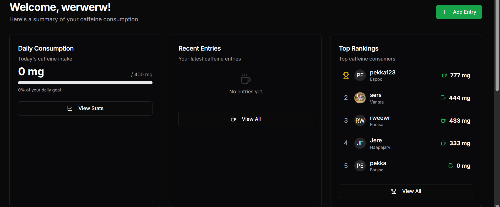
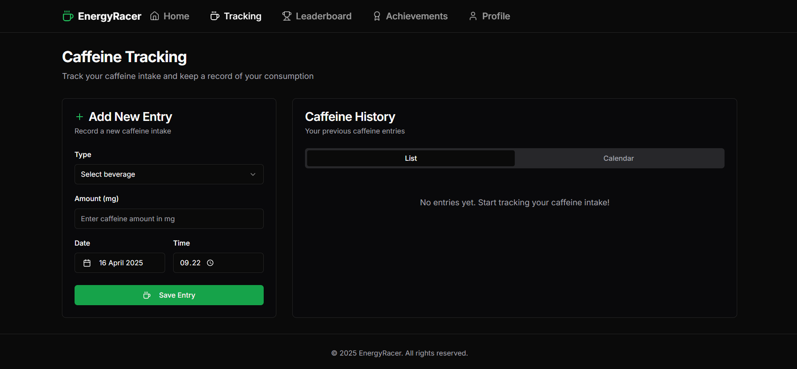
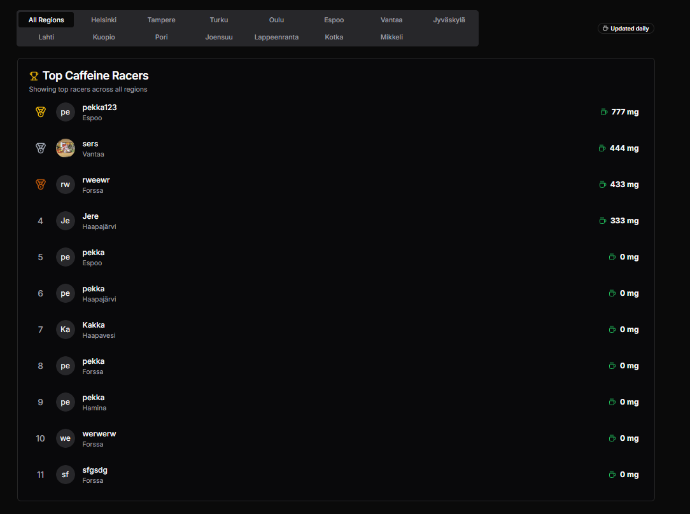
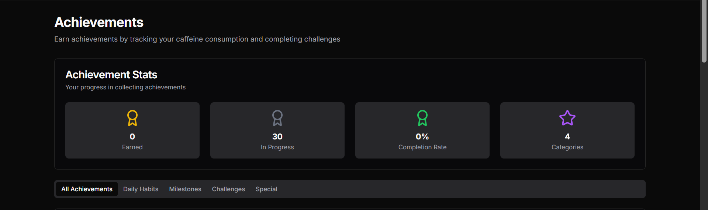

# EnergyRacer

Track your caffeine consumption and compete with your friends! EnergyRacer is a fun way to keep track of your daily caffeine intake.



## Features

- Caffeine consumption tracking with detailed statistics
- Daily and weekly consumption visualization
- Regional leaderboards and rankings
- Achievement system with various challenges
- Customizable consumption goals
- User profiles and preferences
- Responsive and modern user interface





## Technologies

- Next.js 14
- React
- TypeScript
- Tailwind CSS
- Supabase (database and authentication)

## Development Setup

1. Clone the repository:
```bash
git clone https://github.com/JuhoTheOhjelmoija/EnergyRacer.git
cd EnergyRacer
```

2. Install dependencies:
```bash
npm install
```

3. Set up Supabase:
   - Go to [Supabase](https://supabase.com/) and create a new project
   - Go to Project Settings > API
   - Copy the Project URL and Project API key
   - Create a new file `.env` in the project root
   - Add the following to `.env`:
     ```
     NEXT_PUBLIC_SUPABASE_URL=your_project_url
     NEXT_PUBLIC_SUPABASE_ANON_KEY=your_project_api_key
     SUPABASE_URL=your_project_url_again
     SUPABASE_ANON_KEY=your_project_api_key_again
     ```

4. Set up the database:
   - Go to the SQL Editor in Supabase
   - Copy the contents of `supabase/migrations/20240320000000_initial_schema.sql`
   - Paste it into the SQL Editor and click "Run"
   - The result should be "Success. No rows returned"

5. Configure Authentication:
   - Go to Authentication > Sign In / Up
   - Enable "Allow new users to sign up"
   - Scroll down to Auth Providers
   - Configure Email provider:
     - Enable Email provider: ON
     - Confirm email: OFF
     - Secure email change: OFF

6. Start the application:
```bash
# For the best development experience, use:
npm run start
```

The application is now running at [http://localhost:3000](http://localhost:3000)

## Production Deployment

1. Build the application:
```bash
npm run build
```

2. Start the production server:
```bash
npm start
```

The production version is now running at [http://localhost:3000](http://localhost:3000)

## License

MIT

## Acknowledgments

- [Next.js](https://nextjs.org/)
- [Supabase](https://supabase.com/)
- [Shadcn/ui](https://ui.shadcn.com/)
- [Tailwind CSS](https://tailwindcss.com/) 
